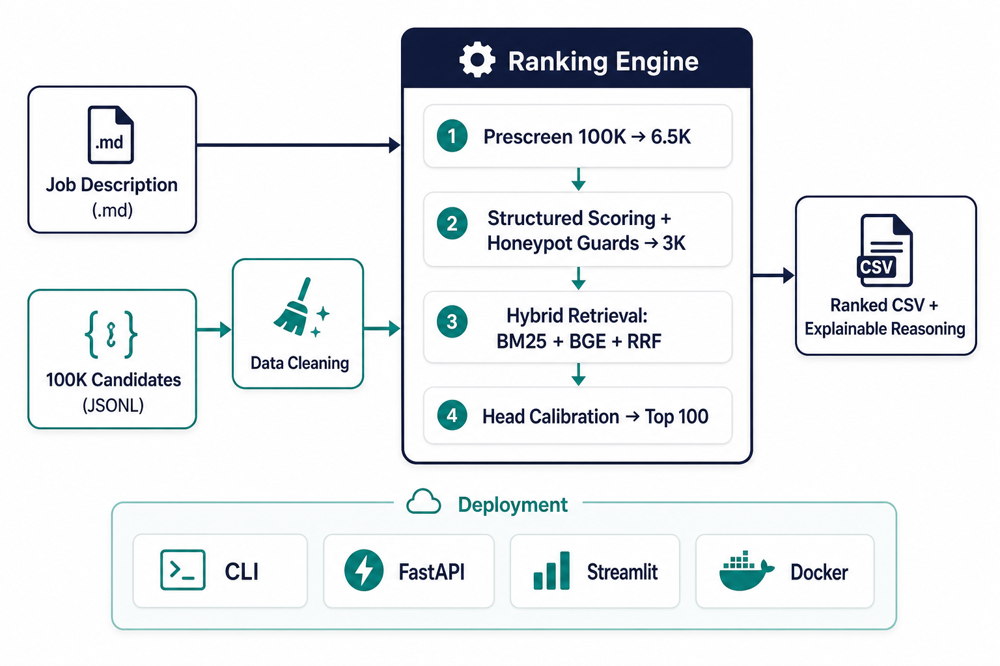
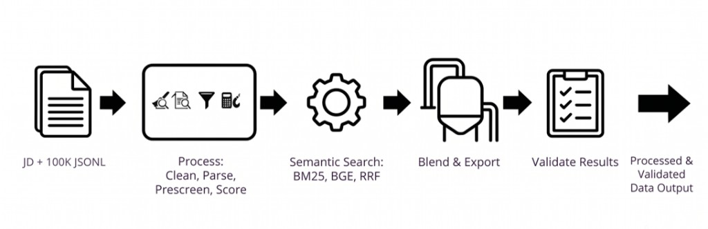

# Redrob Intelligent Candidate Ranker



Rank 100K candidates against a job description and return a top-100 shortlist with scores and reasoning. We combine BM25 + BGE semantic search with structured recruiter signals and honeypot guards, so the list reflects real fit, not keyword stuffing.

**Repo:** [github.com/namrakoyani123/redrob-candidate-ranker-release](https://github.com/namrakoyani123/redrob-candidate-ranker-release)  
**Live demo:** [Streamlit sandbox](https://redrob-candidate-ranker-release-ftechp5q6jwctgwpqtuyae.streamlit.app)

## How it works



**JD + 100K JSONL in** → **Process** (clean, parse JD, prescreen, score + traps) → **Semantic search** (BM25, BGE, RRF) → **Blend & export** top 100 CSV → **Validate** format and monotonic scores.

With a precomputed embedding index, a full run takes about **75-85s** on CPU. Without it, still under the 300s hackathon limit.

## Quick start

```bash
cd redrob-candidate-ranker
python -m venv .venv && .venv\Scripts\activate
pip install -r requirements.txt

python scripts/clean_data.py
python scripts/precompute_embeddings.py --resume   # one-time, ~3-6h
python run.py --skip-clean
```

Official hackathon reproduce:

```bash
python rank.py --official --jd job_description.md -o team_redrob_candidate_ranker.csv
python scripts/validate_submission.py team_redrob_candidate_ranker.csv
```

## Try it

| What | Command / link |
|------|----------------|
| Streamlit sandbox | `streamlit run streamlit_app.py` (official mode matches portal CSV) |
| Web UI + API | `python api.py` then open http://localhost:8000 |
| Docker | `docker build -t redrob-ranker .` then see `submission_metadata.yaml` |

Paste any `.md` or `.txt` JD. The short Redrob header auto-expands to the full `job_description.md`.

## What matters in scoring

- **Structured fit:** role, skills, career evidence, product company history, platform signals (`redrob_signals`).
- **Semantic match:** field-weighted BM25 + BGE-small + RRF.
- **Guards:** honeypot traps, YOE floor, location and notice-period checks.
- **Output:** `candidate_id`, `rank`, `score`, `reasoning`.

Full weights, signal list, and reproduce steps live in [`submission_metadata.yaml`](submission_metadata.yaml).

## Tests

```bash
python -m pytest tests/ -q
```
